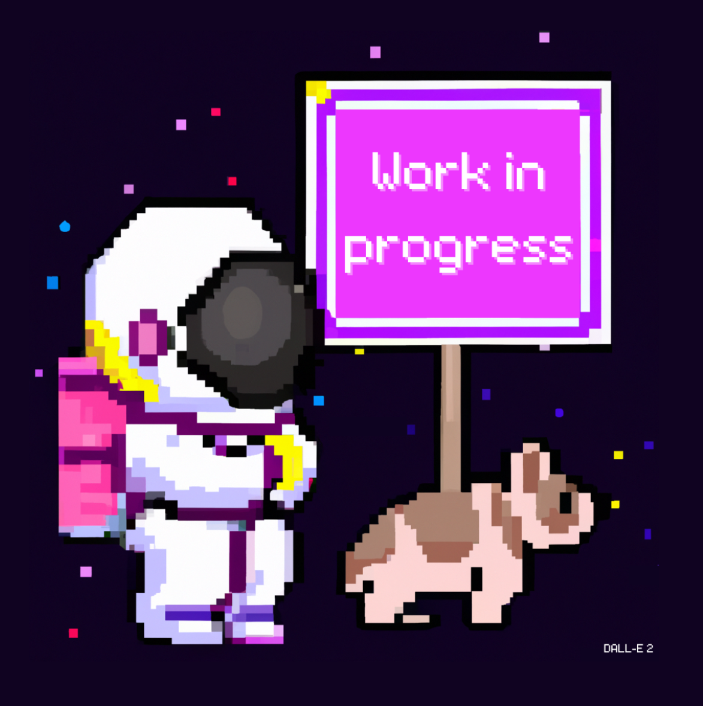

<br />
<p align="center">
  <h3 align="center">Xandão.dev</h3>

  <p align="center">
    My personal website! For you to know more about me and my work.
    <br />
	<br />
    <a href="https://github.com/xandao-dev/xandao.dev"><strong>Explore the docs »</strong></a>
    <br />
    <a href="https://github.com/xandao-dev/xandao.dev/issue">Report Bug</a>
    ·
    <a href="https://github.com/xandao-dev/xandao.dev/issues">Request Feature</a>
  </p>
</p>


<!-- TABLE OF CONTENTS -->
<details open="open">
  <summary>Table of Contents</summary>
  <ol>
    <li>
      <a href="#about-the-project">About The Project</a>
      <ul>
        <li><a href="#features">Features</a></li>
        <li><a href="#built-with">Built With</a></li>
      </ul>
    </li>
    <li>
      <a href="#getting-started">Getting Started</a>
      <ul>
	  	<li><a href="#recommended-ide-setup">Recommended IDE Setup</a></li>
        <li><a href="#installation">Installation</a></li>
      </ul>
    </li>
    <li><a href="#front-end-usage">Front-end Usage</a></li>
    <li><a href="#roadmap">Roadmap</a></li>
    <li><a href="#contributing">Contributing</a></li>
    <li><a href="#license">License</a></li>
    <li><a href="#contact">Contact</a></li>
    <li><a href="#acknowledgements">Acknowledgements</a></li>
  </ol>
</details>


<!-- ABOUT THE PROJECT -->
## About The Project

<div align="center">
  <a href="https://github.com/xandao-dev/xandao.dev">
    
  </a>
</div>

### Features

* Bio
* Projects

### Built With

* [Vue.js 3](https://vuejs.org/) - A progressive framework for web development
* [Svelte](https://svelte.dev/) - A compiler for writing reactive code
* [TypeScript](https://www.typescriptlang.org/) - Typed superset of JavaScript
* [Tailwind CSS](https://tailwindcss.com/) - A utility-first CSS framework


<!-- GETTING STARTED -->
## Getting Started

To get a local copy up and running follow these simple steps.

### Recommended IDE Setup

[VSCode](https://code.visualstudio.com/) + [Volar](https://marketplace.visualstudio.com/items?itemName=Vue.volar) (and disable Vetur) + [TypeScript Vue Plugin (Volar)](https://marketplace.visualstudio.com/items?itemName=Vue.vscode-typescript-vue-plugin).

### Installation

1. Clone the repo
   ```sh
   git clone https://github.com/xandao-dev/xandao.dev.git
   ```
2. Install frontend dependencies
   ```sh
	cd xandao.dev/frontend
	pnpm install
	```
<!-- USAGE EXAMPLES -->
## Front-end Usage

* Starts the development server
	```sh
  cd frontend
  pnpm dev
  ```
* Build for production
  ```sh
  cd frontend
  pnpm build-core
  pnpm build-libs
  ```

<!-- ROADMAP -->
## Roadmap

See the [open issues](https://github.com/xandao-dev/xandao.dev/issues) for a list of proposed features (and known issues).

<!-- CONTRIBUTING -->
## Contributing

Contributions are what make the open source community such an amazing place to be learn, inspire, and create. Any contributions you make are **greatly appreciated**.

1. Fork the Project
2. Create your Feature Branch (`git checkout -b feature/AmazingFeature`)
3. Commit your Changes (`git commit -m 'Add some AmazingFeature'`)
4. Push to the Branch (`git push origin feature/AmazingFeature`)
5. Open a Pull Request

<!-- LICENSE -->
## License

Distributed under the MIT License. See [LICENSE](./LICENSE.md) for more information.

Free software =)

<!-- CONTACT -->
## Contact

Alexandre Calil - [Linkedin](https://www.linkedin.com/in/xandao-dev/) - [alexandre@xandao.dev](mailto:alexandre@xandao.dev)

Project Link: [https://github.com/xandao-dev/xandao.dev](https://github.com/xandao-dev/xandao.dev)

## Acknowledgements

* [Web components](https://developer.mozilla.org/en-US/docs/Web/Web_Components)
* [eslint](https://github.com/eslint/eslint) - code linter
* [prettier](https://github.com/prettier/prettier) - code formatter
* [pnpm](https://pnpm.io/) - performant npm alternative with workspace support
